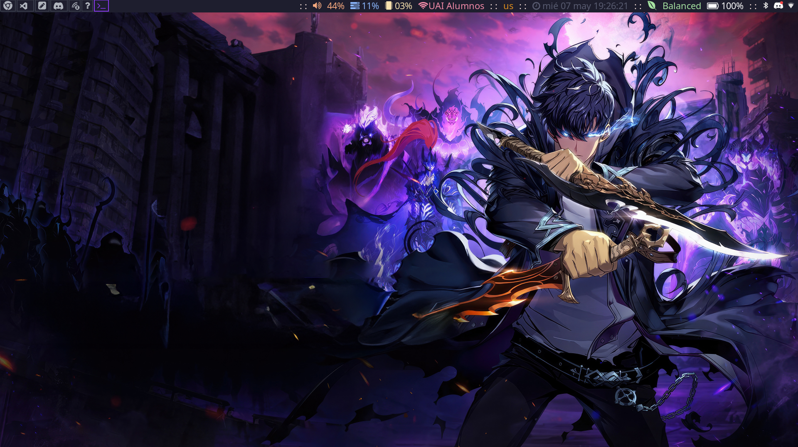

## My System



These are the Dotfiles needed to for my EndevourOS configuration. Use this defaults at your own risk.

> Despite this Repo contains mainly the config for `EndevourOS`, it also includes legacy config files for Debian based `PopOS`, in case I ever go back.

# Initial Setup

This steps needs to be followed in sequential order:

## Set Mouse Theme

In order to set Mouse Theme I need to go to `~/.Xresources` file and modify the following line:

```bash
## These could take any option available in the GTK Settings.
## But changing here is the only way to make it available system wide.
Xcursor.theme: Qogir
```

## Add Text Input to PowerMenu

In the `~/.config/rofi/powermenu.rasi` file, comment out this:

```css
/*removes the text input line*/
mainbox {
  children: [listview];
}
```

## Update EndevourOS Mirrors

For some reason , these mirrors do not have all the software I need as is. So I need to update them. It is important to add: United States, Brazil, Europe and Chile.

## Activate Bluetooth Daemon and GUI (Blueman)

```bash
## This enables bluetooth permanently
sudo systemctl enable bluetooth
```

> Note: Artifacts with pin will need to be paired using `bluetoothctl`.

In order to do that use:

```bash
scan on
```

To search the Device ID and then:

```bash
pair <device_id>
```

> Then they can be used along with the blueman device manager.

## Github

In order to setup my Github Account and SSH I need to run the following commands:

```bash
git config --global user.name "datacubeR"
git config --global user.email "big_drummer2@hotmail.com"
ssh-keygen -t ed25519 -C "big_drummer2@hotmail.com"
```

With this command I need to copy my resulting `.pub` file into SSH settings in Github.

## Download Configuration Repo

```bash
git clone git@github.com:datacubeR/.datacuber.git
```

## Core Programs

Go to the Repo and install all the Core software using:

```bash
make install-core
```

This will install the following:

### From Yay

* Google Chrome (Browser)
* wezterm (we'll see)
* picom (compositor needed for transparency)
* VSCode
* xkblayout-state (To show the current layout)

### From Pacman

* xsel
* ttf-firacode-nerd (Fira Code Nerd Font)
* blueman
* gnome-keyring
* flameshot
* zsh
* zoxide
* eza
* fzf
* bat
* thefuck
* tmux
* Spotify
* Zoom
* tmux
* Neovim
* kitty

### Using `curl`

* Zed
* Starship
* uv

### Using `git`

* Zsh-syntax-hightlighting
* Zsh-autosuggestions
* tpm

## Syncing Configuration with Stow

First of all install GNU Stow:

```bash
sudo pacman -S stow
```

Then go to the `~/.datacuber` folder and run:

```bash
stow .
```

This should create symlinks for the following configs:

* .wallpapers
* .zshrc
* .wezterm.lua (we'll see)
* .tmux.conf
* .config
  * kitty
  * picom
  * Starship
  * i3
  * Neovim (TODO: Probably I will have a dedicated documentation for this!)

## Special Configuration commands

### Zsh

```bash
## This needs to set zsh as the default Shell
chsh -s $(which zsh)
```

### Zsh-Syntax-highlighting and Zsh-Autosuggestions

```bash
source /home/datacuber/zsh-syntax-highlighting/zsh-syntax-highlighting.zsh
source ~/.zsh/zsh-autosuggestions/zsh-autosuggestions.zsh
```

### Starship

```bash
## Changing the Directory for Configuration and starting with Zsh.
export STARSHIP_CONFIG="$HOME/.config/starship/starship.toml"
eval "$(starship init zsh)"
```

## Zoxide

```bash
## Starting zoxide with Zsh
eval "$(zoxide init zsh)"
```

## eza

Setting style in Eza.

```bash
echo 'alias ls="eza --group-directories-first --icons -x --hyperlink -a --show-symlinks --color=always"'
```

## The Fuck

Allowing using the Alias or alternative aliases for The Fuck.

```bash
echo 'eval $(thefuck --alias)'
# You can use whatever you want as an alias, like for Mondays:
echo 'eval $(thefuck --alias FUCK)'
```

## fzf

Set up fzf key bindings and fuzzy completion

```bash
echo 'source <(fzf --zsh)'
```

## ipython

To configure ipython to use it properly in Neovim I need to run the following commands:

```bash
ipython  profile create
```

Then I need to add the following lines in the `~/.ipython/profile_default/ipython_config.py` file:

```bash
# Configuration file for ipython.

from IPython.core.ultratb import VerboseTB

c = get_config()  # noqa
c.InteractiveShellApp.exec_lines = []
c.InteractiveShellApp.exec_lines.append("%load_ext autoreload")
c.InteractiveShellApp.exec_lines.append("%autoreload 2")

c.TerminalInteractiveShell.confirm_exit = False

# turn off that banner w/ version info when first open REPL (i.e. in nvim)
c.TerminalIPythonApp.display_banner = False

# this makes traceback highlights legible:

VerboseTB.tb_highlight = (
    "bg:ansiyellow ansiblack"  # I like the yellow, just want black text
)
```

## Other applications

Some other applications that I need to install because are part of my daily use are:

* `quarto`
* `Zathura` or probably something more powerful.
* `Zotero`
* `Discord`
* `Hugo` for migrating my blog.

## Special Commands (Legacy)

Depending on the OS I'm installing I will need to add some additional configurations. I cannot remember where I got some of them, that is why I'm adding them here in case I need them again.

### Google Chrome

To get access to my keyring autofill and password manager I need to modify my `google-chrome.desktop` file modifying the `Exec` line to look like this:

```bash
Exec=/usr/bin/google-chrome-stable --password-store=gnome-libsecret
```

> Important:
> This may change for other OS, other options that could eventually work are `--password-store=basic` or `--password-store=gnome`. Another option is:  `--incognito`. The thing is I can't remember where I modified this. So I need to check in case is needed.

### Shell Scripts

All the Shell Scripts I need to run needs to have execution permissions. To give them execution permissions I need to run the following command:

```bash
chmod +x <script_name>
```

## Useful commands that I don't want to forget

> Can't remember why I used it

```bash
usermod -aG video ${USER}
```

> Useful to find google-chrome.desktop file.

```bash
sudo nano /usr/share/applications/google-chrome.desktop
```

> Useful to set Zathura as default PDF viewer

```bash
xdg-mime default org.pwmt.zathura.desktop application/pdf
```

> Useful to find the class of a window needed for i3 configuration

```bash
xprop | grep WM_CLASS
```
